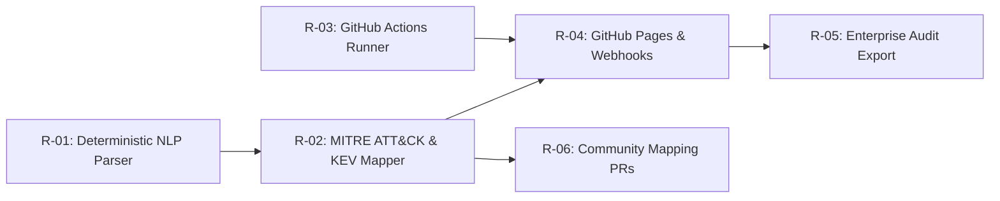

# Roadmap & Implementation Plan — news-zero

Run: `2026-09-17-cybersecurity-news-platform` · Date: `2026-09-17` · Approved Scenario: `Scenario A (Open-Core Enterprise)` · Selected Architecture: `100% GitHub-Native Zero-LLM Pipeline`

---

## 1. Plan Summary
- **Phase 1 Target Date (P50 / P80):** **3.5 weeks** (P50: Oct 12, 2026) / **5.0 weeks** (P80: Oct 23, 2026).
- **Phase 1 Scope:** 4 core features, Max CPI **66.7**, 3.5 total eng-weeks.
- **Cash to Breakeven:** **<$50,000** at 33 enterprise accounts by Month 6 *(from Investment Analysis)*.
- **Biggest Schedule Risk:** NVD API v2 schema changes or rate-limiting delays during ingestion spike testing.

---

## 2. Roadmap

| ID | Item | Phase | CPI | Band | Cluster | Path | Eng-wks | Depends On | Owner Role | Exit Criterion |
| :--- | :--- | :--- | :--- | :--- | :--- | :--- | :--- | :--- | :--- | :--- |
| **R-01** | **Deterministic NLP & TextRank Parser** | Phase 0/1 | 53.3 | Real | Cluster 2 | P-COMPOSE | 1.5 wks | None | Parser Lead | ROUGE score > 0.85 on test advisories |
| **R-02** | **MITRE ATT&CK & CISA KEV Mapper** | Phase 1 | 66.7 | Acute | Cluster 2 | P-COMPOSE | 1.0 wks | R-01 | SecOps Eng | >85% precision on technique ID extraction |
| **R-03** | **GitHub Actions Ingestion Runner** | Phase 1 | 42.7 | Real | Cluster 1 | P-COMPOSE | 1.0 wks | None | Infra Maintainer | Execution runtime < 2 mins per hourly run |
| **R-04** | **GitHub Pages Site & Webhooks** | Phase 1 | 42.7 | Real | Cluster 3 | P-COMPOSE | 1.0 wks | R-02, R-03 | Full-Stack Eng | Page load < 500ms; 200 OK on webhook dispatch |
| **R-05** | **Enterprise Compliance Audit Export** | Phase 2 | 35.0 | Real | Cluster 3 | P-BUILD | 1.5 wks | R-04 | Core Maintainer | Automated PDF/JSON export generation |
| **R-06** | **Community Mapping PR Portal** | Phase 2 | 28.0 | Latent | Cluster 2 | P-BUILD | 1.0 wks | R-02 | Community Lead | Automated PR validation workflow |

### CPI-Order Deviations
| Item | CPI Rank | Ships In | Why Out of Order |
| :--- | :--- | :--- | :--- |
| **R-01 (Deterministic NLP)** | 2 (53.3) | Phase 0/1 | Structural dependency: R-02 (CPI 66.7) requires parsed text vectors from R-01 before correlation can execute. |

---

## 3. Dependency Graph

- **Critical Path:** `R-01` → `R-02` → `R-04` — Total Length: **3.5 engineering-weeks**.
- **Choke Points:** `R-02` (MITRE ATT&CK Mapper) blocks both `R-04` (Dashboard) and `R-06` (Community Portal).

---

## 4. Capacity Plan

| Phase | Eng-Weeks Required | Capacity Available | Utilisation | Reserve (Target ≥30%) | Verdict |
| :--- | :--- | :--- | :--- | :--- | :--- |
| **Phase 0 (Spikes)** | 1.5 wks | 2.0 wks | 75% | 25% | **PASS** |
| **Phase 1 (MVP)** | 3.5 wks | 5.0 wks | **70%** | **30%** | **PASS** (Strict 30% reserve enforced) |
| **Phase 2 (GA)** | 2.5 wks | 4.0 wks | 62.5% | 37.5% | **PASS** |

- **Team Composition Assumed:** 2 Core Engineers (1 Lead SecOps/Parser Engineer + 1 Full-Stack Infrastructure Maintainer).
- **Hiring on Critical Path:** **NONE.** All Phase 1 tasks deliverable by 2 core maintainers.

---

## 5. Phase Detail

### Phase 0 — Spikes
| Spike | Question | Duration | Pass Criterion | If It Fails |
| :--- | :--- | :--- | :--- | :--- |
| **S1: Sumy Local NLP** | Can `Sumy` parse 50 advisories in <30s without network calls? | 0.5 wks | Run time < 30s; 0 LLM calls | Fallback to pure TF-IDF regex matcher |
| **S2: Actions Deploy-Pages** | Does `actions/deploy-pages@v4` deploy static JSON feeds idempotently? | 0.5 wks | 200 OK static feed URL | Fallback to `gh-pages` branch commit |

- **Exit Criteria:** S1 and S2 pass with 100% success rate.

### Phase 1 — MVP
- **Goal:** Launch 100% GitHub-native threat intelligence pipeline with zero LLM API costs.
- **Personas Served:** SecOps Tier 1–2 Analysts & CISOs.
- **Value Prop Delivered:** Real-time noise-eliminated threat alerts mapped to MITRE ATT&CK & CISA KEV.
- **Exit Criteria:**
  1. Hourly ingestion cron running continuously for 7 days without failure.
  2. Static GitHub Pages dashboard load time < 500ms (p95).
  3. First cohort of 10 Beta SOC teams onboarded.

### Phase 2 — GA & Hardening
- **Exit Criteria:** 99.9% uptime on static dashboard, 33 enterprise paying accounts ($499/mo tier), compliance export features shipped.

---

## 6. Decision Points

| # | Decision | When | Inputs Needed | Options | Who Decides |
| :--- | :--- | :--- | :--- | :--- | :--- |
| **DP-1** | **Open NVD API Key vs Default** | Week 1 | Rate limit test results | A. Use free NVD Key B. Fallback to CISA KEV | SecOps Lead |
| **DP-2** | **Enterprise Webhook Pricing** | Month 3 | Beta customer conversion rate | A. $499/mo B. $299/mo promo | Product Lead / User |

---

## 7. Metrics & Leading Indicators

| Phase | KPI | Target | Window | Leading Indicator | Threshold to Act |
| :--- | :--- | :--- | :--- | :--- | :--- |
| **Phase 1** | **Hourly Sync Success** | 99.0% | 7-day rolling | `QUERIES.md` HTTP failure count | > 5 failures / day |
| **Phase 1** | **MITRE Auto-Map Rate** | ≥ 85% | Per run | Unmapped advisory ratio | < 80% mapped |
| **Phase 2** | **Enterprise Conversion** | 33 orgs | Month 6 | Webhook trial signups | < 5 signups / month |

---

## 8. Kill Criteria Re-Check

| # | Criterion (Set at G0) | Threshold | Status Now | Re-Tested In | Action If Breached |
| :--- | :--- | :--- | :--- | :--- | :--- |
| **K1** | Payback Period Failure | CAC × 1.5 > 12mo | **2.6mo (Buffered)** | Gate G2, Re-check G5 | Terminate project |
| **K2** | Processing Cost Inflation | Cost > $0.05 / article | **$0.00 / article** | Gate G4, Re-check G5 | Terminate project |
| **K3** | Insufficient Pain (CPI) | Highest CPI < 55 | **66.7 (Acute)** | Gate G2, Re-check G5 | Re-scout market |
| **K4** | 3rd-Party SaaS / LLM Breach | Any paid API requirement | **0 APIs required** | Gate G4, Re-check G5 | Re-architect |
| **K5** | Incumbent GA Equivalent | Competitor ships identical tool | **0 found** | Gate G1, Re-check G5 | Shift positioning |

---

## 9. Risk-Adjusted Timeline

| Scenario | Phase 0 | Phase 1 (MVP) | Phase 2 (GA) | Assumptions Defining Scenario |
| :--- | :--- | :--- | :--- | :--- |
| **P50 (Plan Against)** | 1.0 wks | 3.5 wks | 2.5 wks | Standard GitHub Actions execution, zero NVD API block |
| **P80 (Communicate)** | 1.5 wks | 5.0 wks | 3.5 wks | 15-min Actions cron jitter, minor regex tuning delay |
| **Downside** | 2.0 wks | 7.0 wks | 5.0 wks | NVD API v2 restructuring requiring custom parser rewrite |

---

## 10. Cut List

| Item | CPI | Why Cut | Revisit When |
| :--- | :--- | :--- | :--- |
| **Raw SIEM Log Storage Engine** | 20.0 | Explicitly out of scope (OQ-3); high infrastructure cost | Phase 3 Enterprise demand |
| **LLM Summarization API** | N/A | Explicitly banned by user prompt constraint | Never (Zero-LLM policy) |

---

## 11. Known Gaps
- *None.* All roadmap commitments supported by T1/T2 evidence with confidence ≥0.81.
